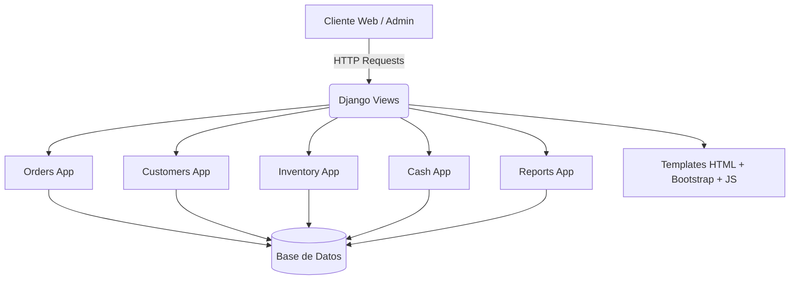
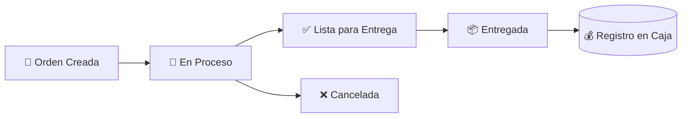
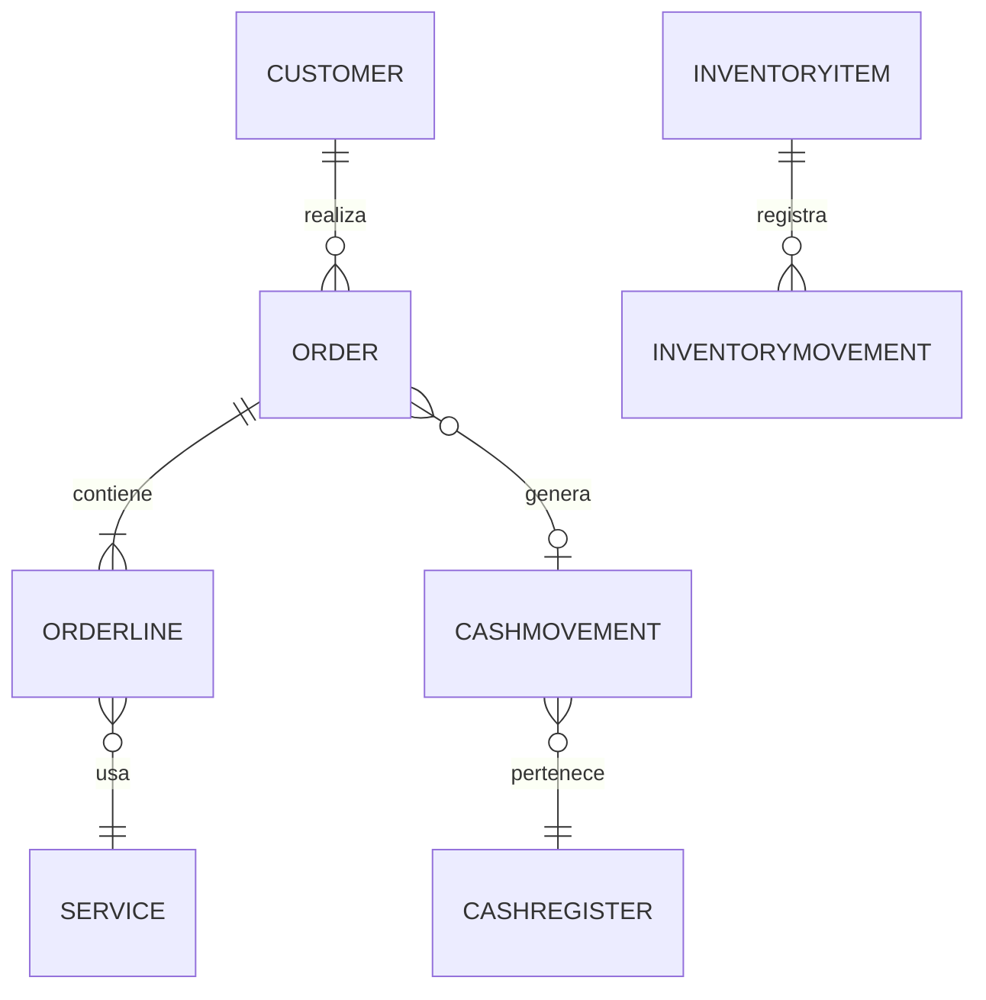

# 🧺 Clean Studio — Sistema de Gestión de Lavandería

**Clean Studio** es una aplicación web desarrollada con **Django + Django REST Framework**, diseñada para la administración integral de lavanderías: manejo de órdenes, clientes, inventario, caja y reportes.  
Incluye un panel administrativo con **Jazzmin** y una interfaz modular adaptable a futuras versiones SaaS.

---

## 🚀 Características Principales

- **Gestión de Órdenes:** creación, seguimiento y actualización de estados (pendiente, listo, entregado, cancelado).  
- **Clientes:** registro y trazabilidad de servicios.  
- **Servicios:** administración de servicios, categorías y tipos de cobro (por prenda, por libra, por servicio).  
- **Inventario:** control de insumos, existencias mínimas, movimientos y costos unitarios.  
- **Caja:** apertura y cierre, registro de ingresos y egresos vinculados a órdenes.  
- **Reportes:** estadísticas de ventas, clientes, inventario y caja.  
- **Temas visuales:** identidad visual dinámica (logo, favicon, textos, colores).  

---

## 🧩 Arquitectura General

El sistema está dividido en módulos (apps Django) organizados por responsabilidad:

```
clean_studio/
│
├── accounts/        # Usuarios y autenticación
├── catalog/         # Servicios y categorías
├── customers/       # Clientes
├── orders/          # Órdenes y seguimiento
├── inventory/       # Insumos y movimientos
├── cash/            # Caja y movimientos financieros
├── reports/         # Reportes y estadísticas
├── theme/           # Identidad visual dinámica
└── dashboard/       # Vistas generales y panel principal
```

---

## 🧭 Diagrama de Arquitectura



---

## 🔁 Flujo de Órdenes



**Descripción:**
1. El usuario crea una orden con uno o varios servicios.  
2. Cuando cambia el estado a “entregado”, el sistema genera automáticamente un movimiento de caja.  
3. Los reportes reflejan en tiempo real las estadísticas de ventas y clientes.  

---

## 🧮 Modelo de Datos (simplificado)



---

## ⚙️ Requisitos Técnicos

**Backend**
- Python 3.11+  
- Django 5.x  
- Django REST Framework  
- Jazzmin  
- Pillow  

**Frontend**
- Bootstrap 5  
- Material Symbols  
- JavaScript Vanilla

---

## 🧱 Instalación y Configuración

```bash
git clone https://github.com/tuusuario/clean_studio.git
cd clean_studio

python -m venv venv
source venv/bin/activate  # Linux/Mac
venv\Scripts\activate   # Windows

pip install -r requirements.txt
python manage.py migrate
python manage.py createsuperuser
python manage.py runserver
```

Accede a [http://127.0.0.1:8000](http://127.0.0.1:8000)

---

## 🧾 Ejemplo de Flujo de Caja Automatizado

```python
if next_status == "entregado":
    active_register = CashRegister.objects.filter(is_open=True).last()
    if active_register:
        CashMovement.objects.create(
            register=active_register,
            movement_type="ingreso",
            amount=order.final_amount,
            description=f"Pago de orden {order.code}",
            related_order=order,
            created_by=request.user,
        )
```

---

## 🎨 Jazzmin y Temas Dinámicos

El panel administrativo usa Jazzmin, configurado en `settings.py` con `JAZZMIN_SETTINGS` y enlazado al modelo `Theme`  
para cambiar logos, colores, textos y favicon desde la interfaz sin reiniciar el servidor.

---

## 🧑‍💻 Autor

**Jairol Anthony Grullón Amparo**  

---
